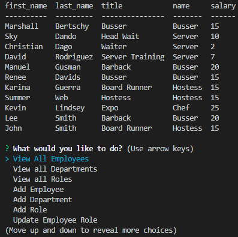

# Employeetracker
```
As a business owner
I want to be able to view and manage the departments, roles, and employees in my company
So that I can organize and plan my business
```

## Table of Contents

* [Installation](#installation)
* [Usage](#usage)
* [Credits](#credits)
* [Contributing](#contributing)
* [Questions](#questions)
* [License](#license)

## Installation
Npm Install

## Usage

[Watch Video Tutorial](https://drive.google.com/file/d/1g459whXe36Q3GJBG3Vhmpzx0Ecq2FTOq/view)




## Credits

* Node.js
* inquirer
* mysql
* cTables

## Contributing

  * Update employee managers

  * View employees by manager

  * Delete departments, roles, and employees

  * View the total utilized budget of a department -- ie the combined salaries of all employees in that department

## Questions

Any questions? Feel free to message me on GitHub at anytime!

## License

Unlicensed!